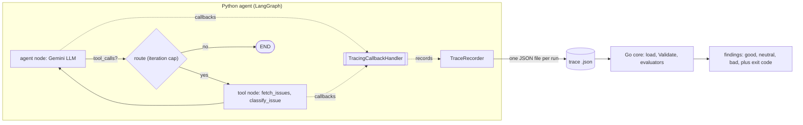

# trazo

[](https://github.com/Cro22/trazo/actions/workflows/ci.yml)
[](https://github.com/Cro22/trazo/releases)
[](go.mod)
[](LICENSE)

Trajectory evaluation for LLM agents. trazo ingests agent run traces as JSON and
runs evaluators over them, producing findings with a severity taxonomy. The core
is written in Go; a Python LangGraph reference agent proves the framework end to
end: real agent produces real traces, and the unmodified Go core evaluates them.

## Install

The CLI is a single self-contained binary with no runtime dependencies.

```bash
# With the Go toolchain (installs into $GOBIN):
go install github.com/Cro22/trazo/cmd/trazo@latest

# Or from source:
git clone https://github.com/Cro22/trazo && cd trazo
make build        # -> ./bin/trazo   (or: go build -o trazo ./cmd/trazo)
```

Prebuilt binaries for Linux, macOS, and Windows (amd64 and arm64) are attached to
each [GitHub release](https://github.com/Cro22/trazo/releases). Verify a download
against the release's `checksums.txt`, then put the binary on your `PATH`.

`trazo version` reports the product version, the supported trace schema version,
and the build's git commit and time.

## The severity taxonomy

Every finding carries one judgment (`evaluator/Evaluator.go`):

- **good**: correct, expected behavior. No action needed.
- **neutral**: an anomaly whose cause may be external to the agent (a dropped
  event, an interrupted run, broken instrumentation). Surfaced for review, not
  blamed on the trajectory.
- **bad**: a failure attributable to the agent and actionable now (for example a
  tool that returned an error).

## The Go core

- `trajectory/` — the `Run`/`Step` model, the JSON loader, and `Validate()`
  (structural invariants: ids, timestamps, per-type required fields).
- `evaluator/` — the `Evaluator` interface and the evaluators:
  - `tool_calls` — pairs each tool result with its call by `toolCallId` when
    present (authoritative, order-independent), falling back to tool name in FIFO
    order only when a result carries no id; flags orphans (neutral) and tool
    errors (bad).
  - `loops` — flags repetition (same tool plus identical input, or same node)
    at least `MaxRepeats` times; catches runaways the pairing check cannot see.
  - `cost_latency` — flags per-step and whole-run cost/latency budget breaches
    (neutral).
  - `node_transitions` — flags runs that do not end at a terminal node (neutral).
  - `llm_judge` — opt-in; grades the final output with a model (good/neutral/bad).
- `runner/` — loads every `.json` file in a directory (concurrently, with
  deterministic output order) and runs the evaluators.
- `cmd/trazo/` — the CLI. Thresholds are overridable with flags
  (`-max-repeats`, `-max-step-cost`, `-max-run-latency-ms`, `-terminal-nodes`,
  ...); `-llm-judge` enables the judge (needs `GEMINI_API_KEY`).

```bash
go build ./... && go test ./...
go run ./cmd/trazo -dir ./testdata/runs          # human-readable
go run ./cmd/trazo -dir ./testdata/runs -json    # machine-readable
```

Output formats: `-format text` (default), `-format json` (or `-json`), and
`-format md` for a Markdown report (verdict, severity counts, findings table),
suitable for a CI job summary or PR comment.

Exit codes: `0` clean, `1` at least one `bad` finding, `2` at least one file
error (file errors take precedence). Note: `go run` remaps a non-zero program
exit to its own `1`; build the binary to observe the true code in CI:

```bash
go build -o trazo ./cmd/trazo && ./trazo -dir <dir> ; echo $?
```

### Continuous integration

`.github/workflows/ci.yml` builds and tests the Go core and the Python agent,
then runs a `trazo-gate` job that demonstrates trazo gating a pipeline: it passes
on a directory of clean traces (`testdata/ci/clean`, exit 0) and asserts that a
directory with a bad finding (`testdata/ci/failing`) makes trazo exit non-zero.
The Markdown report is written to the job summary. This is how trazo fails a
build on a `JudgmentBad`.

## Core documentation

- [docs/config.md](docs/config.md) — the `-config` evaluator policy file and
  the defaults < config < flags precedence.
- [docs/output.md](docs/output.md) — the versioned JSON output envelope.
- [docs/versioning.md](docs/versioning.md) — product versus trace-schema
  versioning and the release process.
- [docs/llm-judge.md](docs/llm-judge.md) — the opt-in LLM-as-judge evaluator:
  determinism, timeouts, cost, and failure handling.
- [docs/security.md](docs/security.md) — what a trace holds, the one component
  that sends data off-machine, and how to keep private traces private.

## Reference agent (LangGraph)

`agents/langgraph-reference/` is a GitHub-issue triage agent built with
LangGraph. It calls Gemini, fetches open issues, classifies them, and writes a
short triage report, emitting a trazo trace for every LLM call, tool call, and
tool result. trazo is the only observability layer here; there is no LangSmith or
other external tracing.



The graph is an LLM node plus a tool node joined by a conditional edge with an
iteration cap (the runaway guard), with in-memory checkpointing. Tracing lives
entirely in a callback handler, so the agent logic stays clean.

### Quickstart (3 steps)

From the repo root. Requires Go and Python 3.11+.

1. Install the agent:

   ```powershell
   cd agents/langgraph-reference
   python -m venv .venv
   .venv\Scripts\Activate.ps1        # POSIX: source .venv/bin/activate
   pip install -r requirements.txt
   ```

2. Run the agent (needs a Gemini key in `GEMINI_API_KEY`, or a `.env` at the repo
   root with `GEMINI_API_KEY=...`; the CLI loads it automatically):

   ```powershell
   python -m agent run --repo psf/requests --traces-dir ./_traces
   ```

3. Evaluate the emitted trace with the Go core (from the repo root):

   ```powershell
   go run ./cmd/trazo -dir ./agents/langgraph-reference/_traces
   ```

A real run against `psf/requests` produces a clean 15-step trace (5 LLM calls,
3 tool call/result pairs) that the Go runner evaluates with zero findings.

### Failure scenarios

The agent ships scripted, offline failure modes (no API key, no network) that
demonstrate each severity. See
[docs/evaluation-results.md](agents/langgraph-reference/docs/evaluation-results.md)
for the full matrix with the real Go runner output.

```powershell
python -m agent run --repo any/repo --traces-dir ./_traces --scenario tool-error       # -> bad
python -m agent run --repo any/repo --traces-dir ./_traces --scenario orphan-tool-call  # -> neutral
python -m agent run --repo any/repo --traces-dir ./_traces --scenario runaway-loop      # -> bad (loop detected)
```

### Docs

- [Trace schema](agents/langgraph-reference/docs/trace-schema.md) — the JSON
  format, field by field.
- [Sample trace](agents/langgraph-reference/docs/sample-trace.json) — a hand
  written clean run.
- [Evaluation results](agents/langgraph-reference/docs/evaluation-results.md) —
  the failure matrix.

### Cost

Model tier is a cheap flash model (`gemini-2.5-flash` by default) with
temperature 0 and a low output-token cap. A full triage of one repo is about
2,400 tokens and costs roughly **$0.002** per run. Override the model with
`--model` and bound the loop with `--iteration-cap`.

## License

MIT. See [LICENSE](LICENSE).
